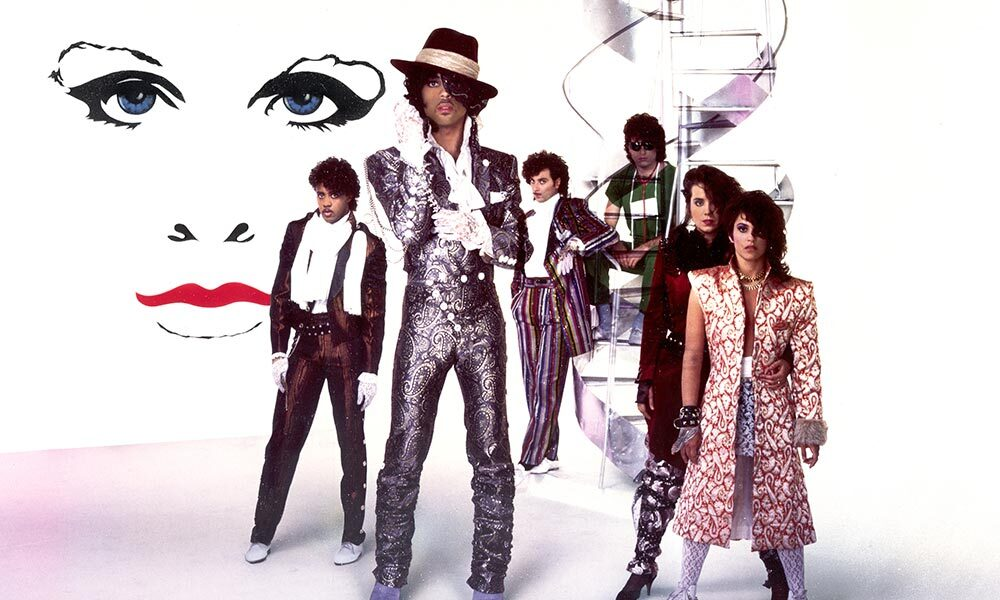
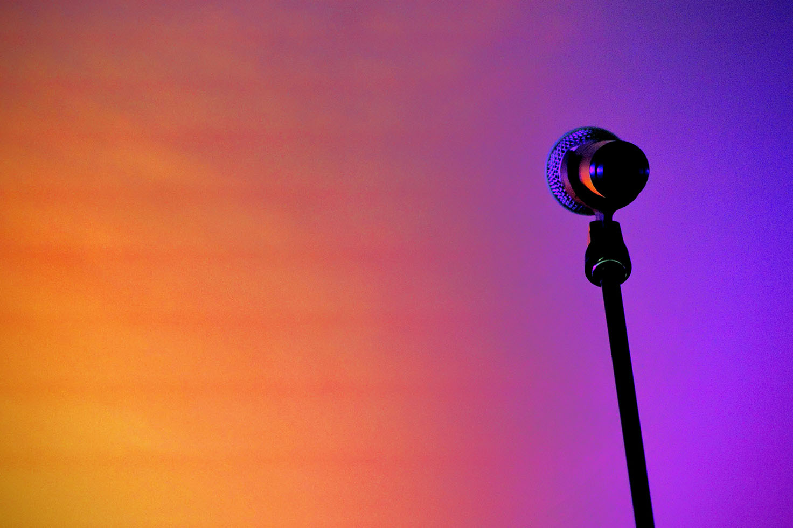
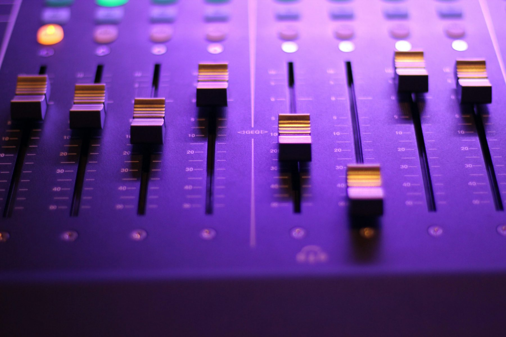

<h1>
<strong> Project Title:  The Revolution </strong>

 

</h1>

https://herokuapp.com/

“Recorded music permeates every aspect of our daily lives and legal access-based music services combined with illegal online file sharing services means that more or less every song is available everywhere, all the time. This access explosion transforms the way people use and relate to recorded music.”

 - https://www.bbvaopenmind.com/en/books/19-key-essays-on-how-internet-is-changing-our-lives/    

 

## Background

Project Description/Outline:

To begin, our team took the GTZAN Genre Collection Dataset found at www.kaggle.com which consists of 1,000 audio tracks each 30 seconds long to train our model. The dataset contains 10 genres, each represented by 100 tracks which are all 22050 Hz monophonic 16-bit audio files in .au format. We will use these files to train our model utilizing machine learning in order to classify dataset audio files and uploaded 30 second sample sets into the following genres: blues, classical, country, disco, hiphop, jazz, reggae, rock, metal and pop.

### Visualizations

By first loading our dataset into Jupyter Notebook we were able to use the Python package Librosa to perform an analysis on these music audio files. Through audio acquisition and playback, the Librosa module allowed us to analyze the audio signals of the 1,000 music samples and train our model using 5 second samples. After creating the spectrograms and saving these as images we were able to train our model on these files. 

Using Librosa, we built a MIR (Music Information Retrieval System) which produced spectrograms from the analysis. These spectrograms are a visual representation of the spectrum of frequencies of sound as they vary over time. In 2 dimensional representations, the x axis is frequency while the second axis is time. These visual changes in frequency are what we were able to use to train our model to determine where genre differences lie. 

### Datasets Used 

   

Datasets Used:
https://www.kaggle.com/carlthome/gtzan-genre-collection

    
   <i>Vanessa Simpson, Stephanie Plaza, Victoria Cruz, Ibet Hernandez
</i>
    
   <i>UTSA | Trilogy Data Analytics Bootcamp 2020</i>
